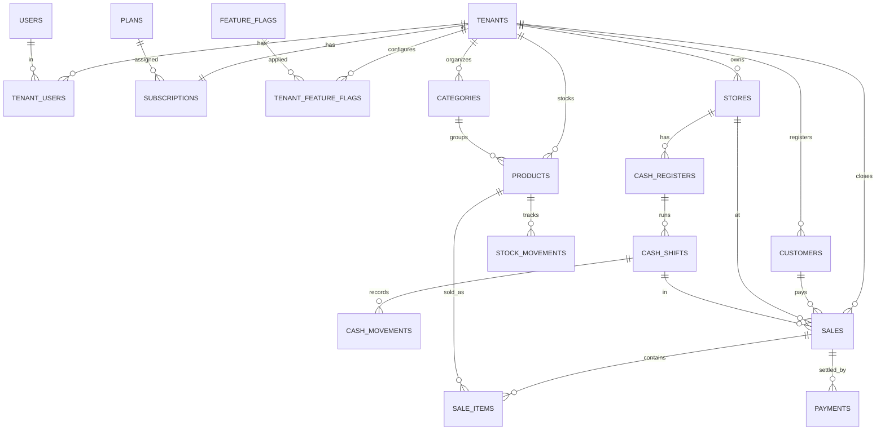

# Database — NinjaSoft POS

> Modelo de datos multi-tenant sobre Postgres (Supabase). Este documento es la referencia técnica de todas las tablas, relaciones, índices y policies.

---

## 1. Principios de diseño

Resumen (ver `docs/01-mvp.md` § 3):

1. **`tenant_id` obligatorio** en toda tabla operativa, con FK a `tenants(id)` y RLS activa.
2. **UUID v4** en todas las primary keys (`gen_random_uuid()`).
3. **Timestamps universales:** `created_at`, `updated_at`, `created_by`, `updated_by`.
4. **Baja lógica** con `deleted_at`.
5. **Auditoría automática** con triggers en tablas críticas.

---

## 2. Función `current_tenant_id()`

Función fundamental que extrae el tenant del JWT del usuario. Toda RLS la usa.

```sql
create or replace function current_tenant_id()
returns uuid
language sql stable
as $$
  select (auth.jwt() ->> 'tenant_id')::uuid
$$;
```

El `tenant_id` se inyecta al JWT al hacer login, después de elegir tenant (custom claim o app metadata).

---

## 3. Triggers globales

### 3.1. `set_updated_at`

```sql
create or replace function set_updated_at()
returns trigger language plpgsql as $$
begin new.updated_at = now(); return new; end;
$$;
```

Aplicar a toda tabla mutable.

### 3.2. `write_audit_log`

Trigger genérico que registra cambios en `audit_logs`:

```sql
create or replace function write_audit_log()
returns trigger language plpgsql as $$
begin
  insert into audit_logs (
    tenant_id, actor_user_id, entity_type, entity_id, action,
    before_data, after_data
  )
  values (
    coalesce(new.tenant_id, old.tenant_id),
    (auth.jwt() ->> 'sub')::uuid,
    tg_table_name,
    coalesce(new.id, old.id),
    tg_op,
    case when tg_op in ('UPDATE','DELETE') then to_jsonb(old) else null end,
    case when tg_op in ('INSERT','UPDATE') then to_jsonb(new) else null end
  );
  return coalesce(new, old);
end;
$$;
```

Aplicar a tablas críticas: `sales`, `payments`, `cash_shifts`, `subscriptions`, `tenant_users`, `tenant_feature_flags`, `users`.

---

## 4. Tablas del MVP

### 4.1. Globales del SaaS (sin `tenant_id`)

#### `tenants`

```sql
create table tenants (
  id           uuid primary key default gen_random_uuid(),
  name         text not null,
  slug         text not null unique,
  cuit         text,
  industry     text check (industry in ('kiosco','textil','retail','restaurante','pyme','otro')),
  country      text not null default 'AR',
  status       text not null default 'trial' check (status in ('trial','active','past_due','suspended','cancelled')),
  trial_ends_at timestamptz,
  created_at   timestamptz not null default now(),
  updated_at   timestamptz not null default now(),
  deleted_at   timestamptz
);

create index tenants_status_idx on tenants(status);
create index tenants_slug_idx on tenants(slug);
```

#### `plans`

```sql
create table plans (
  id           uuid primary key default gen_random_uuid(),
  key          text not null unique check (key in ('start','pro','business','enterprise')),
  name         text not null,
  description  text,
  monthly_price_ars numeric(12,2) not null,
  yearly_price_ars  numeric(12,2),
  limits       jsonb not null default '{}'::jsonb,
  is_active    boolean not null default true,
  created_at   timestamptz default now()
);
```

`limits` ejemplo:
```json
{ "stores": 3, "users": 10, "sales_per_month": 50000 }
```

#### `feature_flags`

```sql
create table feature_flags (
  id              uuid primary key default gen_random_uuid(),
  key             text not null unique,
  description     text,
  default_enabled boolean not null default false,
  created_at      timestamptz default now()
);
```

Ejemplos de keys: `afip_enabled`, `multi_store`, `promotions_v2`, `barcode_scanner`, `csv_import`.

#### `system_settings`

```sql
create table system_settings (
  key   text primary key,
  value jsonb not null,
  updated_at timestamptz default now()
);
```

#### `users`

Manejada por Supabase Auth en `auth.users`. Tabla espejo en `public.users` para datos públicos:

```sql
create table public.users (
  id          uuid primary key references auth.users(id) on delete cascade,
  email       text not null unique,
  full_name   text,
  avatar_url  text,
  locale      text default 'es-AR',
  is_internal boolean not null default false,  -- staff NinjaSoft
  created_at  timestamptz default now(),
  updated_at  timestamptz default now()
);
```

#### `audit_logs`

```sql
create table audit_logs (
  id             uuid primary key default gen_random_uuid(),
  tenant_id      uuid,
  actor_user_id  uuid,
  entity_type    text not null,
  entity_id      uuid,
  action         text not null,  -- INSERT, UPDATE, DELETE, custom (sale_voided, plan_changed...)
  before_data    jsonb,
  after_data     jsonb,
  reason         text,
  ip_address     inet,
  user_agent     text,
  created_at     timestamptz not null default now()
);

create index audit_logs_tenant_idx on audit_logs(tenant_id, created_at desc);
create index audit_logs_entity_idx on audit_logs(entity_type, entity_id);
create index audit_logs_actor_idx on audit_logs(actor_user_id, created_at desc);
```

`audit_logs` es **append-only**: no se permite UPDATE ni DELETE (excepto para retención programada).

### 4.2. Relaciones tenant ↔ usuarios

#### `tenant_users`

```sql
create table tenant_users (
  id         uuid primary key default gen_random_uuid(),
  tenant_id  uuid not null references tenants(id) on delete cascade,
  user_id    uuid not null references users(id) on delete cascade,
  role       text not null check (role in ('owner','manager','cashier','viewer')),
  status     text not null default 'active' check (status in ('active','suspended','invited')),
  invited_at timestamptz,
  joined_at  timestamptz,
  created_at timestamptz default now(),
  updated_at timestamptz default now(),
  unique(tenant_id, user_id)
);

create index tenant_users_user_idx on tenant_users(user_id);
create index tenant_users_tenant_idx on tenant_users(tenant_id);
```

#### `subscriptions`

```sql
create table subscriptions (
  id             uuid primary key default gen_random_uuid(),
  tenant_id      uuid not null references tenants(id) on delete cascade unique,
  plan_id        uuid not null references plans(id),
  status         text not null check (status in ('trial','active','past_due','suspended','cancelled')),
  billing_cycle  text not null default 'monthly' check (billing_cycle in ('monthly','yearly')),
  current_period_start timestamptz,
  current_period_end   timestamptz,
  cancel_at_period_end boolean default false,
  created_at     timestamptz default now(),
  updated_at     timestamptz default now()
);
```

#### `tenant_feature_flags`

```sql
create table tenant_feature_flags (
  id              uuid primary key default gen_random_uuid(),
  tenant_id       uuid not null references tenants(id) on delete cascade,
  feature_flag_id uuid not null references feature_flags(id) on delete cascade,
  enabled         boolean not null,
  configured_by   uuid references users(id),
  configured_at   timestamptz default now(),
  unique(tenant_id, feature_flag_id)
);
```

### 4.3. Operativas del tenant

#### `stores` (sucursales)

```sql
create table stores (
  id         uuid primary key default gen_random_uuid(),
  tenant_id  uuid not null references tenants(id),
  name       text not null,
  address    text,
  phone      text,
  is_default boolean default false,
  is_active  boolean default true,
  created_at timestamptz default now(),
  updated_at timestamptz default now(),
  deleted_at timestamptz
);
```

#### `cash_registers` (cajas)

```sql
create table cash_registers (
  id         uuid primary key default gen_random_uuid(),
  tenant_id  uuid not null references tenants(id),
  store_id   uuid not null references stores(id),
  name       text not null,
  is_active  boolean default true,
  created_at timestamptz default now(),
  updated_at timestamptz default now()
);
```

#### `categories`

```sql
create table categories (
  id          uuid primary key default gen_random_uuid(),
  tenant_id   uuid not null references tenants(id),
  parent_id   uuid references categories(id),
  name        text not null,
  sort_order  int default 0,
  is_active   boolean default true,
  created_at  timestamptz default now(),
  updated_at  timestamptz default now(),
  deleted_at  timestamptz
);
```

#### `products`

```sql
create table products (
  id              uuid primary key default gen_random_uuid(),
  tenant_id       uuid not null references tenants(id),
  category_id     uuid references categories(id),
  sku             text,
  barcode         text,
  name            text not null,
  description     text,
  price           numeric(12,2) not null check (price >= 0),
  cost            numeric(12,2),
  stock           numeric(12,3) not null default 0,
  stock_min       numeric(12,3) default 0,
  unit            text default 'un',  -- un, kg, lt, etc.
  image_url       text,
  is_active       boolean default true,
  metadata        jsonb default '{}'::jsonb,
  created_at      timestamptz default now(),
  updated_at      timestamptz default now(),
  created_by      uuid references users(id),
  updated_by      uuid references users(id),
  deleted_at      timestamptz
);

create unique index products_tenant_sku_idx on products(tenant_id, sku) where sku is not null and deleted_at is null;
create unique index products_tenant_barcode_idx on products(tenant_id, barcode) where barcode is not null and deleted_at is null;
create index products_tenant_name_idx on products(tenant_id, name);
create index products_category_idx on products(category_id);
```

#### `stock_movements`

```sql
create table stock_movements (
  id          uuid primary key default gen_random_uuid(),
  tenant_id   uuid not null references tenants(id),
  product_id  uuid not null references products(id),
  store_id    uuid references stores(id),
  delta       numeric(12,3) not null,  -- positivo = ingreso, negativo = egreso
  reason      text not null check (reason in ('purchase','sale','sale_void','adjustment','transfer','loss','return')),
  reference_id uuid,                   -- id de la venta, ajuste, etc.
  notes       text,
  created_at  timestamptz default now(),
  created_by  uuid references users(id)
);

create index stock_movements_product_idx on stock_movements(product_id, created_at desc);
create index stock_movements_tenant_idx on stock_movements(tenant_id, created_at desc);
```

#### `customers`

```sql
create table customers (
  id              uuid primary key default gen_random_uuid(),
  tenant_id       uuid not null references tenants(id),
  name            text not null,
  document_type   text check (document_type in ('cuit','dni','cuil','passport','other')),
  document_number text,
  iva_condition   text check (iva_condition in ('consumidor_final','responsable_inscripto','monotributo','exento','no_responsable')),
  email           text,
  phone           text,
  address         text,
  notes           text,
  is_active       boolean default true,
  metadata        jsonb default '{}'::jsonb,
  created_at      timestamptz default now(),
  updated_at      timestamptz default now(),
  deleted_at      timestamptz
);

create index customers_tenant_doc_idx on customers(tenant_id, document_number);
create index customers_tenant_name_idx on customers(tenant_id, name);
```

#### `cash_shifts` (turnos de caja)

```sql
create table cash_shifts (
  id                  uuid primary key default gen_random_uuid(),
  tenant_id           uuid not null references tenants(id),
  cash_register_id    uuid not null references cash_registers(id),
  opened_by           uuid not null references users(id),
  closed_by           uuid references users(id),
  opened_at           timestamptz not null default now(),
  closed_at           timestamptz,
  opening_amount      numeric(12,2) not null,
  expected_amount     numeric(12,2),
  closing_amount      numeric(12,2),
  difference          numeric(12,2) generated always as (closing_amount - expected_amount) stored,
  status              text not null default 'open' check (status in ('open','closed')),
  notes               text,
  created_at          timestamptz default now(),
  updated_at          timestamptz default now()
);

create index cash_shifts_tenant_idx on cash_shifts(tenant_id, opened_at desc);
create index cash_shifts_register_idx on cash_shifts(cash_register_id, status);
```

#### `cash_movements`

```sql
create table cash_movements (
  id              uuid primary key default gen_random_uuid(),
  tenant_id       uuid not null references tenants(id),
  cash_shift_id   uuid not null references cash_shifts(id),
  type            text not null check (type in ('income','expense','sale','sale_void')),
  amount          numeric(12,2) not null,
  payment_method  text,
  reason          text,
  reference_id    uuid,           -- id de venta cuando aplica
  created_at      timestamptz default now(),
  created_by      uuid references users(id)
);

create index cash_movements_shift_idx on cash_movements(cash_shift_id, created_at);
```

#### `sales`

```sql
create table sales (
  id                uuid primary key default gen_random_uuid(),
  tenant_id         uuid not null references tenants(id),
  store_id          uuid not null references stores(id),
  cash_shift_id     uuid references cash_shifts(id),
  customer_id       uuid references customers(id),
  number            bigint not null,   -- número correlativo por tenant
  status            text not null default 'completed' check (status in ('completed','voided','suspended')),
  subtotal          numeric(12,2) not null,
  discount_total    numeric(12,2) not null default 0,
  tax_total         numeric(12,2) not null default 0,
  total             numeric(12,2) not null,
  notes             text,
  voided_at         timestamptz,
  voided_by         uuid references users(id),
  void_reason       text,
  created_at        timestamptz default now(),
  updated_at        timestamptz default now(),
  created_by        uuid references users(id),
  unique(tenant_id, number)
);

create index sales_tenant_created_idx on sales(tenant_id, created_at desc);
create index sales_shift_idx on sales(cash_shift_id);
create index sales_customer_idx on sales(customer_id);
create index sales_status_idx on sales(tenant_id, status);
```

#### `sale_items`

```sql
create table sale_items (
  id            uuid primary key default gen_random_uuid(),
  tenant_id     uuid not null references tenants(id),
  sale_id       uuid not null references sales(id) on delete cascade,
  product_id    uuid not null references products(id),
  product_name  text not null,     -- snapshot
  sku           text,              -- snapshot
  quantity      numeric(12,3) not null,
  unit_price    numeric(12,2) not null,
  discount      numeric(12,2) not null default 0,
  subtotal      numeric(12,2) not null,
  created_at    timestamptz default now()
);

create index sale_items_sale_idx on sale_items(sale_id);
create index sale_items_product_idx on sale_items(product_id);
```

#### `payments`

```sql
create table payments (
  id            uuid primary key default gen_random_uuid(),
  tenant_id     uuid not null references tenants(id),
  sale_id       uuid not null references sales(id) on delete cascade,
  method        text not null check (method in ('cash','debit','credit','transfer','qr','other')),
  amount        numeric(12,2) not null,
  reference     text,              -- número de cupón, qr, etc.
  metadata      jsonb default '{}'::jsonb,
  created_at    timestamptz default now()
);

create index payments_sale_idx on payments(sale_id);
create index payments_tenant_method_idx on payments(tenant_id, method, created_at desc);
```

---

## 5. Diagrama ER simplificado



---

## 6. Reglas de RLS

Patrón estándar aplicado a toda tabla con `tenant_id`:

```sql
alter table <t> enable row level security;

create policy "<t>_select" on <t> for select
  using (tenant_id = current_tenant_id());

create policy "<t>_insert" on <t> for insert
  with check (tenant_id = current_tenant_id());

create policy "<t>_update" on <t> for update
  using (tenant_id = current_tenant_id())
  with check (tenant_id = current_tenant_id());
```

Tablas globales (sin `tenant_id`):

- `tenants`, `plans`, `feature_flags`, `system_settings`: solo lectura para usuarios autenticados, escritura solo via `service_role` (panel interno).
- `users`: cada usuario solo ve y edita su propia fila.
- `audit_logs`: cada tenant ve solo sus logs; INSERT permitido a `service_role` y triggers; UPDATE/DELETE bloqueados.

Documentación detallada por tabla en `supabase/policies/<tabla>.md`.

---

## 7. Datos snapshot en `sale_items`

Las columnas `product_name` y `sku` se copian al crear el item porque el producto puede cambiar después. La venta debe ser **inmutable en su contenido** una vez completada.

---

## 8. Numeración correlativa de ventas

`sales.number` es un correlativo por tenant. Se genera en la Edge Function `create_sale` con `select coalesce(max(number), 0) + 1 from sales where tenant_id = X for update;` dentro de la transacción.

Cuando entre AFIP (Fase 2), se sumará `point_of_sale` y `voucher_number` AFIP.

---

## 9. Migraciones iniciales sugeridas

Orden recomendado de migraciones para el Hito 0:

1. `00001_extensions.sql` — `pgcrypto`, etc.
2. `00002_functions_helpers.sql` — `current_tenant_id`, `set_updated_at`, `write_audit_log`.
3. `00003_users_and_tenants.sql` — `tenants`, `users`, `tenant_users`.
4. `00004_plans_and_subscriptions.sql` — `plans`, `subscriptions`.
5. `00005_feature_flags.sql` — `feature_flags`, `tenant_feature_flags`.
6. `00006_audit_logs.sql`.
7. `00007_rls_globals.sql` — RLS para tablas globales.
8. `00008_stores_and_registers.sql`.
9. `00009_catalog.sql` — `categories`, `products`, `stock_movements`.
10. `00010_customers.sql`.
11. `00011_cash_shifts.sql` + `cash_movements`.
12. `00012_sales.sql` + `sale_items` + `payments`.
13. `00013_rls_operational.sql` — RLS para todas las tablas operativas.
14. `00014_audit_triggers.sql` — triggers en tablas críticas.
15. `00015_indexes_performance.sql` — índices finales.

Cada una a entregar por el agente `supabase-architect`.

---

## 10. Convenciones generales

- Nombres de tablas: **snake_case plural** (`products`, `cash_shifts`).
- Columnas: **snake_case** (`created_at`, `tenant_id`).
- Foreign keys: `<entidad>_id`.
- Booleans: prefijo `is_` o `has_` (`is_active`, `has_inventory`).
- Estados: columna `status` con `CHECK` constraint, valores en minúsculas y `snake_case`.
- Dinero: `numeric(12,2)` para ARS, `numeric(12,3)` para cantidades fraccionarias.
- Fechas: `timestamptz` siempre (UTC).
